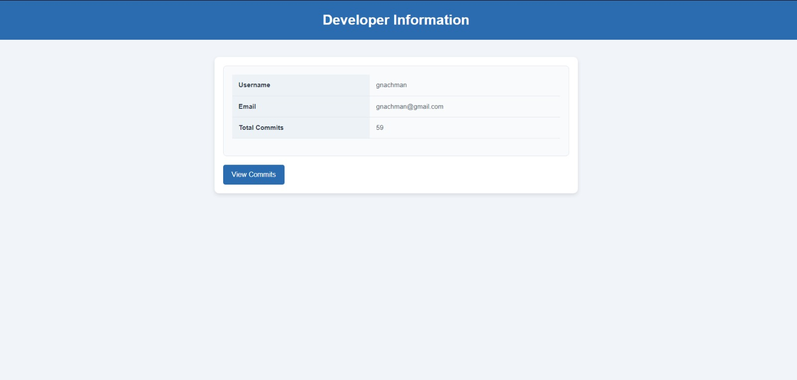
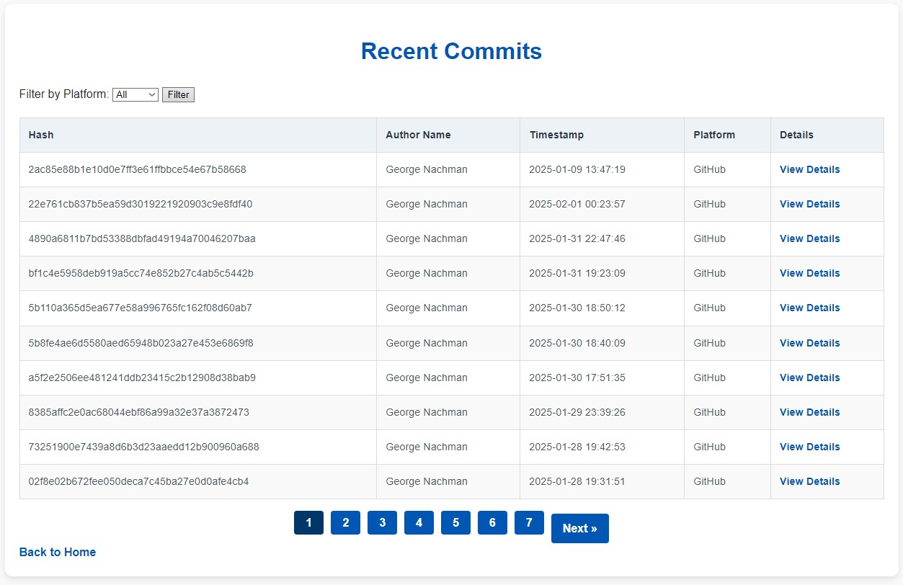
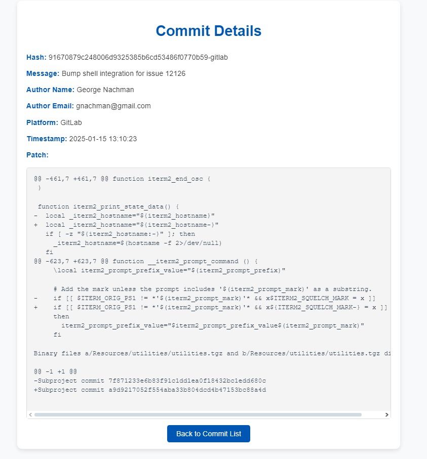

# Commit Dashboard

**Commit Dashboard**, GitHub ve GitLab üzerinden commitleri otomatik olarak çekip, belirli kriterlere göre filtreleyen ve bunları bir veritabanına kaydeden bir Java uygulamasıdır. Kullanıcı dostu bir arayüz sağlamak için Thymeleaf kullanılarak görselleştirme yapılmıştır.

---

## Özellikler

- **GitHub** ve **GitLab** üzerinden commitleri otomatik olarak çekme.
- Commitleri yazar veya tarih aralığına göre filtreleme.
- Commit metadatalarını veritabanına kaydetme.
- **Thymeleaf** ile:
  - Commit detaylarını görüntüleme.
  - Son commitleri listeleme.
  - Geliştirici bilgilerini görüntüleme.
- Modüler ve ölçeklenebilir mimari ile kolay genişletilebilirlik.

---

## Kullanılan Teknolojiler

- **Java 17**: Backend geliştirme için.
- **Spring Boot**: Uygulama geliştirme framework'ü.
- **Hibernate/JPA**: Veritabanı işlemleri için ORM.
- **MySQL**: Commit ve geliştirici verilerini saklamak için ilişkisel veritabanı.
- **Thymeleaf**: Web arayüzü geliştirme.
- **REST API**: GitHub ve GitLab'dan commitleri çekmek için.

---

## Kurulum ve Başlatma

1. **Projeyi Klonlayın**
   ```bash
   git clone https://github.com/kullanici-adiniz/commit-dashboard.git
   cd commit-dashboard
   ```
  
### Veritabanını Ayarlayın

1. MySQL'de bir veritabanı oluşturun (ör. `commit_dashboard`).

2. Projede yer alan `application.properties` dosyasını aşağıdaki gibi düzenleyin:
   ```properties
   spring.datasource.url=jdbc:mysql://localhost:3306/veritabanı adı
   spring.datasource.username=veritabani_kullanici_adi
   spring.datasource.password=veritabani_sifre
   ```

## Uygulama Endpoints

### Ana Sayfa

- **URL**: [http://localhost:8080/developer](http://localhost:8080/developer)  
- Geliştirici bilgilerini ve toplam commit sayısını gösterir.

### Commit Listesi

- **URL**: [http://localhost:8080/developer/commits](http://localhost:8080/developer/commits)  
- Son commitlerin listesini gösterir.

### Commit Detayları

- **URL**: [http://localhost:8080/developer/commits/{id}](http://localhost:8080/developer/commits/{id})  
- Belirli bir commit ile ilgili detayları gösterir.


# Proje Görselleri

## Geliştirici Sayfası


## Commit Listesi


## Commit Detayları



